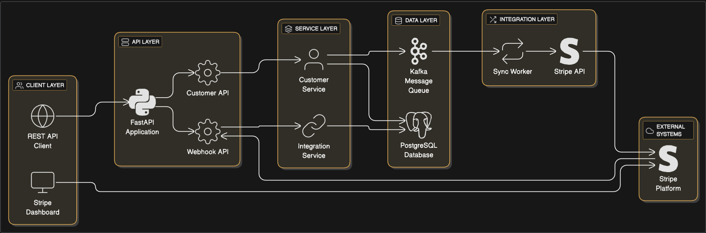
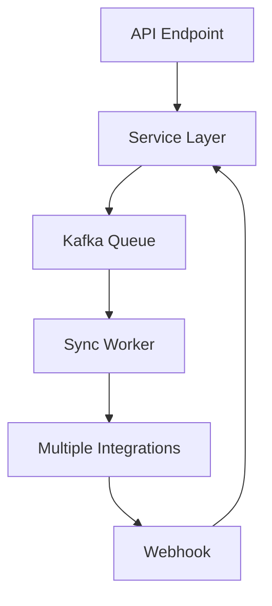

# 🚀 Two-Way Integration System

A production-ready two-way customer synchronization system between your internal database and Stripe, built with FastAPI, PostgreSQL (Neon), and Kafka.



## 🏗️ Architecture

The system provides real-time bidirectional synchronization between your internal database and Stripe:

- **FastAPI REST API** for customer management
- **PostgreSQL database** (Neon) for data persistence
- **Kafka** for event-driven synchronization
- **Stripe integration** for external system sync
- **Webhook support** for real-time updates

## ✨ Features

- ✅ **Two-way customer synchronization** with Stripe
- ✅ **Real-time event processing** using Kafka
- ✅ **Webhook support** for Stripe events
- ✅ **RESTful API** with FastAPI
- ✅ **Production-ready** logging and error handling
- ✅ **Fault-tolerant** service management

## 🚀 Quick Start

### Prerequisites
- Python 3.8+
- Docker & Docker Compose
- Git
- ngrok account (free at https://ngrok.com)
- Neon Postgres account (free at https://neon.tech)
- Stripe test account (free at https://stripe.com)

> **🪟 Windows Users**: See [Windows Setup Guide](docs/WINDOWS_SETUP.md) for detailed Windows-specific instructions.

### One-Command Setup

#### **🍎 macOS / 🐧 Linux**
```bash
# Make scripts executable
chmod +x *.sh

# Complete setup and start all services
./setup_complete.sh
```

#### **🪟 Windows**
```cmd
# Complete setup and start all services
setup_complete_windows.bat
```

This will:
- ✅ Set up the entire environment
- ✅ Configure ngrok with your authtoken
- ✅ Start all services (API, Worker, ngrok)
- ✅ Provide webhook URL for Stripe setup

### Service Management

#### **🍎 macOS / 🐧 Linux**
```bash
# Check status of all services
./manage.sh status

# Test the system
./manage.sh test

# Stop all services
./manage.sh stop

# Start all services
./manage.sh start

# Restart all services
./manage.sh restart

# View service logs
./manage.sh logs
```

#### **🪟 Windows**
```cmd
# Check status of all services
manage_windows.bat status

# Test the system
manage_windows.bat test

# Stop all services
manage_windows.bat stop

# Start all services
manage_windows.bat start

# Restart all services
manage_windows.bat restart

# View service logs
manage_windows.bat logs
```

## 📊 Service URLs

- **Local API**: http://localhost:8000
- **API Docs**: http://localhost:8000/docs
- **Health Check**: http://localhost:8000/health
- **ngrok Dashboard**: http://localhost:4040

## 🧪 Testing

### API Health Check
```bash
curl http://localhost:8000/health
```

### Create Customer
```bash
curl -X POST http://localhost:8000/customers/ \
  -H "Content-Type: application/json" \
  -d '{"name":"John Doe","email":"john@example.com"}'
```

### List Customers
```bash
curl http://localhost:8000/customers/
```

## 📁 Project Structure

```
zenskar-integration/
├── app/                     # Application code
│   ├── main.py             # FastAPI application
│   ├── api/                # API endpoints
│   ├── models/              # Database models
│   ├── schemas/             # Pydantic schemas
│   ├── services/            # Business logic
│   ├── integrations/        # External system integrations
│   ├── queue/               # Kafka producer/consumer
│   └── workers/             # Background workers
├── docs/                    # Documentation
├── tests/                   # Test files
├── docker-compose.yml       # Kafka setup
└── requirements.txt         # Python dependencies
```

## 📚 Documentation

- **[Quick Start Guide](docs/QUICK_START.md)** - Detailed setup instructions
- **[Windows Setup Guide](docs/WINDOWS_SETUP.md)** - Windows-specific setup instructions
- **[Environment Setup](docs/ENVIRONMENT_SETUP.md)** - Complete environment configuration
- **[Deployment Guide](docs/DEPLOYMENT.md)** - Production deployment
- **[Docker Setup](docs/DOCKER_SETUP.md)** - Docker installation guide
- **[Test Results](docs/TEST_RESULTS.md)** - System testing results
- **[Architecture](docs/architecture.md)** - System architecture and data flow

## 🔧 Troubleshooting

### Common Issues

```bash
# Port 8000 already in use
./manage.sh stop

# Services not starting
./manage.sh status
./manage.sh logs

# Reset everything
./manage.sh stop
docker-compose down
./setup_complete.sh
```

### Debug Commands

```bash
# Check all services
./manage.sh status

# View logs
./manage.sh logs

# Test system
./manage.sh test
```

## 🔗 Integration Architecture

The system is built with an extensible integration architecture that supports multiple external systems and entity types.

### 🏗️ **Current Integrations**

#### **Stripe Integration**
- **Two-way sync** with Stripe customer catalog
- **Webhook support** for real-time updates
- **Event-driven** synchronization via Kafka
- **ID mapping** between internal and Stripe IDs

### 🚀 **Adding New Integrations**

#### **1. Salesforce Integration Example**

**Step 1: Create Integration Class**
```python
# app/integrations/salesforce_integration.py
from app.integrations.base import BaseIntegration
import salesforce_api  # Your Salesforce SDK

class SalesforceIntegration(BaseIntegration):
    @property
    def integration_name(self) -> str:
        return "salesforce"
    
    def create_customer(self, customer_data: Dict[str, Any]) -> Optional[str]:
        # Implement Salesforce customer creation
        pass
    
    def update_customer(self, external_id: str, customer_data: Dict[str, Any]) -> bool:
        # Implement Salesforce customer update
        pass
    
    def delete_customer(self, external_id: str) -> bool:
        # Implement Salesforce customer deletion
        pass
    
    def get_customer(self, external_id: str) -> Optional[Dict[str, Any]]:
        # Implement Salesforce customer retrieval
        pass
```

**Step 2: Register Integration**
```python
# In app/integrations/factory.py
from app.integrations.salesforce_integration import SalesforceIntegration

IntegrationFactory.register_integration("salesforce", SalesforceIntegration)
```

**Step 3: Create Salesforce Worker**
```python
# app/workers/salesforce_worker.py
class SalesforceSyncWorker(SyncWorker):
    def __init__(self):
        self.integration = IntegrationFactory.get_integration("salesforce")
```

#### **2. HubSpot Integration Example**

**Step 1: Create HubSpot Integration**
```python
# app/integrations/hubspot_integration.py
class HubSpotIntegration(BaseIntegration):
    @property
    def integration_name(self) -> str:
        return "hubspot"
    
    # Implement all required methods...
```

**Step 2: Register and Use**
```python
# Register integration
IntegrationFactory.register_integration("hubspot", HubSpotIntegration)

# Use in worker
hubspot_worker = HubSpotSyncWorker()
```

### 📊 **Multi-Integration Support**

#### **Multiple Integrations per Entity**
```python
# Sync to multiple systems simultaneously
integrations = ["stripe", "salesforce", "hubspot"]
for integration_name in integrations:
    integration = IntegrationFactory.get_integration(integration_name)
    integration.create_customer(customer_data)
```

#### **Integration-Specific Workers**
```python
# Separate workers for different integrations
stripe_worker = StripeSyncWorker()
salesforce_worker = SalesforceSyncWorker()
hubspot_worker = HubSpotSyncWorker()
```

### 🎯 **Entity Type Extensions**

#### **Invoice Catalog Integration**

**Step 1: Create Invoice Models**
```python
# app/models/invoice.py
class Invoice(Base):
    __tablename__ = "invoices"
    id = Column(Integer, primary_key=True)
    customer_id = Column(Integer, ForeignKey("customers.id"))
    amount = Column(Numeric(10, 2))
    status = Column(String(50))
    # ... other fields
```

**Step 2: Create Invoice Schemas**
```python
# app/schemas/invoice.py
class InvoiceCreate(BaseModel):
    customer_id: int
    amount: float
    status: str
```

**Step 3: Create Invoice Integrations**
```python
# app/integrations/stripe_invoice_integration.py
class StripeInvoiceIntegration(BaseIntegration):
    def create_invoice(self, invoice_data: Dict[str, Any]) -> Optional[str]:
        # Create Stripe invoice
        pass
```

**Step 4: Create Invoice Workers**
```python
# app/workers/invoice_sync_worker.py
class InvoiceSyncWorker:
    def __init__(self):
        self.stripe_integration = IntegrationFactory.get_integration("stripe_invoice")
        self.salesforce_integration = IntegrationFactory.get_integration("salesforce_invoice")
```

### 🔄 **Integration Patterns**

#### **Event-Driven Architecture**


#### **ID Mapping System**
- **Universal Mapping**: Works with any integration
- **Bidirectional**: Internal ↔ External ID mapping
- **Multi-Entity**: Customers, invoices, products, etc.
- **Multi-Integration**: Stripe, Salesforce, HubSpot, etc.

### 🛠️ **Integration Development Guide**

#### **Required Methods**
Every integration must implement:
- `create_entity()` - Create in external system
- `update_entity()` - Update in external system
- `delete_entity()` - Delete from external system
- `get_entity()` - Retrieve from external system

#### **Best Practices**
- **Error Handling**: Comprehensive error management
- **Logging**: Detailed operation logging
- **Idempotency**: Prevent duplicate operations
- **Rate Limiting**: Respect external API limits
- **Authentication**: Secure credential management

#### **Testing Integrations**
```python
# Test integration functionality
def test_salesforce_integration():
    integration = SalesforceIntegration()
    result = integration.create_customer(test_data)
    assert result is not None
```

### 📈 **Scaling Considerations**

#### **Horizontal Scaling**
- **Multiple Workers**: Run multiple sync workers
- **Load Balancing**: Distribute events across workers
- **Partitioning**: Use Kafka partitioning for parallel processing

#### **Performance Optimization**
- **Connection Pooling**: Reuse external API connections
- **Batch Processing**: Process multiple events together
- **Caching**: Cache frequently accessed data
- **Monitoring**: Track integration performance

## 🔗 Integration Architecture

The system is built with an extensible integration architecture that supports multiple external systems and entity types.

### 🏗️ **Current Integrations**

#### **Stripe Integration**
- **Two-way sync** with Stripe customer catalog
- **Webhook support** for real-time updates
- **Event-driven** synchronization via Kafka
- **ID mapping** between internal and Stripe IDs

### 🚀 **Adding New Integrations**

#### **1. Salesforce Integration Example**

**Step 1: Create Integration Class**
```python
# app/integrations/salesforce_integration.py
from app.integrations.base import BaseIntegration
import salesforce_api  # Your Salesforce SDK

class SalesforceIntegration(BaseIntegration):
    @property
    def integration_name(self) -> str:
        return "salesforce"
    
    def create_customer(self, customer_data: Dict[str, Any]) -> Optional[str]:
        # Implement Salesforce customer creation
        pass
    
    def update_customer(self, external_id: str, customer_data: Dict[str, Any]) -> bool:
        # Implement Salesforce customer update
        pass
    
    def delete_customer(self, external_id: str) -> bool:
        # Implement Salesforce customer deletion
        pass
    
    def get_customer(self, external_id: str) -> Optional[Dict[str, Any]]:
        # Implement Salesforce customer retrieval
        pass
```

**Step 2: Register Integration**
```python
# In app/integrations/factory.py
from app.integrations.salesforce_integration import SalesforceIntegration

IntegrationFactory.register_integration("salesforce", SalesforceIntegration)
```

**Step 3: Create Salesforce Worker**
```python
# app/workers/salesforce_worker.py
class SalesforceSyncWorker(SyncWorker):
    def __init__(self):
        self.integration = IntegrationFactory.get_integration("salesforce")
```

#### **2. HubSpot Integration Example**

**Step 1: Create HubSpot Integration**
```python
# app/integrations/hubspot_integration.py
class HubSpotIntegration(BaseIntegration):
    @property
    def integration_name(self) -> str:
        return "hubspot"
    
    # Implement all required methods...
```

**Step 2: Register and Use**
```python
# Register integration
IntegrationFactory.register_integration("hubspot", HubSpotIntegration)

# Use in worker
hubspot_worker = HubSpotSyncWorker()
```

### 📊 **Multi-Integration Support**

#### **Multiple Integrations per Entity**
```python
# Sync to multiple systems simultaneously
integrations = ["stripe", "salesforce", "hubspot"]
for integration_name in integrations:
    integration = IntegrationFactory.get_integration(integration_name)
    integration.create_customer(customer_data)
```

#### **Integration-Specific Workers**
```python
# Separate workers for different integrations
stripe_worker = StripeSyncWorker()
salesforce_worker = SalesforceSyncWorker()
hubspot_worker = HubSpotSyncWorker()
```

### 🎯 **Entity Type Extensions**

#### **Invoice Catalog Integration**

**Step 1: Create Invoice Models**
```python
# app/models/invoice.py
class Invoice(Base):
    __tablename__ = "invoices"
    id = Column(Integer, primary_key=True)
    customer_id = Column(Integer, ForeignKey("customers.id"))
    amount = Column(Numeric(10, 2))
    status = Column(String(50))
    # ... other fields
```

**Step 2: Create Invoice Schemas**
```python
# app/schemas/invoice.py
class InvoiceCreate(BaseModel):
    customer_id: int
    amount: float
    status: str
```

**Step 3: Create Invoice Integrations**
```python
# app/integrations/stripe_invoice_integration.py
class StripeInvoiceIntegration(BaseIntegration):
    def create_invoice(self, invoice_data: Dict[str, Any]) -> Optional[str]:
        # Create Stripe invoice
        pass
```

**Step 4: Create Invoice Workers**
```python
# app/workers/invoice_sync_worker.py
class InvoiceSyncWorker:
    def __init__(self):
        self.stripe_integration = IntegrationFactory.get_integration("stripe_invoice")
        self.salesforce_integration = IntegrationFactory.get_integration("salesforce_invoice")
```

### 🔄 **Integration Patterns**

#### **Event-Driven Architecture**


#### **ID Mapping System**
- **Universal Mapping**: Works with any integration
- **Bidirectional**: Internal ↔ External ID mapping
- **Multi-Entity**: Customers, invoices, products, etc.
- **Multi-Integration**: Stripe, Salesforce, HubSpot, etc.

### 🛠️ **Integration Development Guide**

#### **Required Methods**
Every integration must implement:
- `create_entity()` - Create in external system
- `update_entity()` - Update in external system
- `delete_entity()` - Delete from external system
- `get_entity()` - Retrieve from external system

#### **Best Practices**
- **Error Handling**: Comprehensive error management
- **Logging**: Detailed operation logging
- **Idempotency**: Prevent duplicate operations
- **Rate Limiting**: Respect external API limits
- **Authentication**: Secure credential management

#### **Testing Integrations**
```python
# Test integration functionality
def test_salesforce_integration():
    integration = SalesforceIntegration()
    result = integration.create_customer(test_data)
    assert result is not None
```

### 📈 **Scaling Considerations**

#### **Horizontal Scaling**
- **Multiple Workers**: Run multiple sync workers
- **Load Balancing**: Distribute events across workers
- **Partitioning**: Use Kafka partitioning for parallel processing

#### **Performance Optimization**
- **Connection Pooling**: Reuse external API connections
- **Batch Processing**: Process multiple events together
- **Caching**: Cache frequently accessed data
- **Monitoring**: Track integration performance

## 🎯 API Endpoints

### Customers
- `POST /customers/` - Create customer
- `GET /customers/` - List customers
- `GET /customers/{id}` - Get customer by ID
- `PUT /customers/{id}` - Update customer
- `DELETE /customers/{id}` - Delete customer

### Webhooks
- `POST /webhooks/stripe` - Stripe webhook endpoint

### Health
- `GET /health` - Health check
- `GET /` - API information

## 🚀 Production Deployment

For production deployment, see the [Deployment Guide](docs/DEPLOYMENT.md).


---

## 👤 Author

**Palak** — [@palak2006-ctrl](https://github.com/palak2006-ctrl)

---

**🎉 Ready to go!** Run `./setup_complete.sh` to get started with your two-way integration system.

