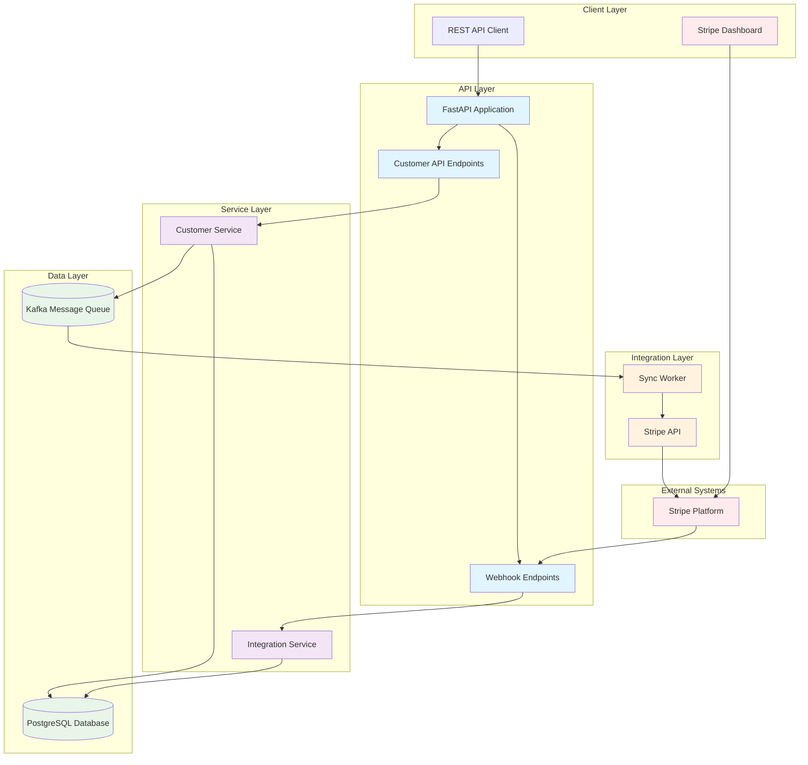

# 🏗️ System Architecture

## Implementation Flow Diagram

## Data Flow Explanation

### 1. **Customer Creation Flow**
1. Client sends POST request to `/customers/`
2. FastAPI validates request using Pydantic schemas
3. Customer Service creates customer in PostgreSQL
4. Event published to Kafka topic
5. Sync Worker processes event
6. Customer created in Stripe via API
7. Mapping stored between internal and Stripe IDs

### 2. **Stripe Webhook Flow**
1. Customer updated in Stripe Dashboard
2. Stripe sends webhook to `/webhooks/stripe`
3. Webhook handler validates signature
4. Integration Service processes webhook
5. Customer updated in PostgreSQL
6. Event published to Kafka for other integrations

### 3. **Event-Driven Architecture**
- **Kafka Producer**: Publishes events when data changes
- **Kafka Consumer**: Processes events for external sync
- **Idempotency**: Prevents duplicate processing
- **Error Handling**: Retry mechanisms for failed operations

## Key Components

### **API Layer**
- **FastAPI**: Modern, fast web framework
- **Pydantic**: Data validation and serialization
- **RESTful Endpoints**: Standard HTTP methods
- **Error Handling**: Proper HTTP status codes

### **Service Layer**
- **Customer Service**: Business logic for customer operations
- **Integration Service**: Handles external system mappings
- **Event Publishing**: Kafka event generation

### **Data Layer**
- **PostgreSQL**: Primary database (Neon)
- **Kafka**: Message queue for event processing
- **Database Migrations**: Alembic for schema management

### **Integration Layer**
- **Stripe Integration**: External API communication
- **Sync Worker**: Background event processing
- **Webhook Handler**: Real-time external updates

## Scalability Features

- **Horizontal Scaling**: Multiple worker instances
- **Event Processing**: Asynchronous message handling
- **Database Optimization**: Connection pooling
- **Monitoring**: Health checks and logging
